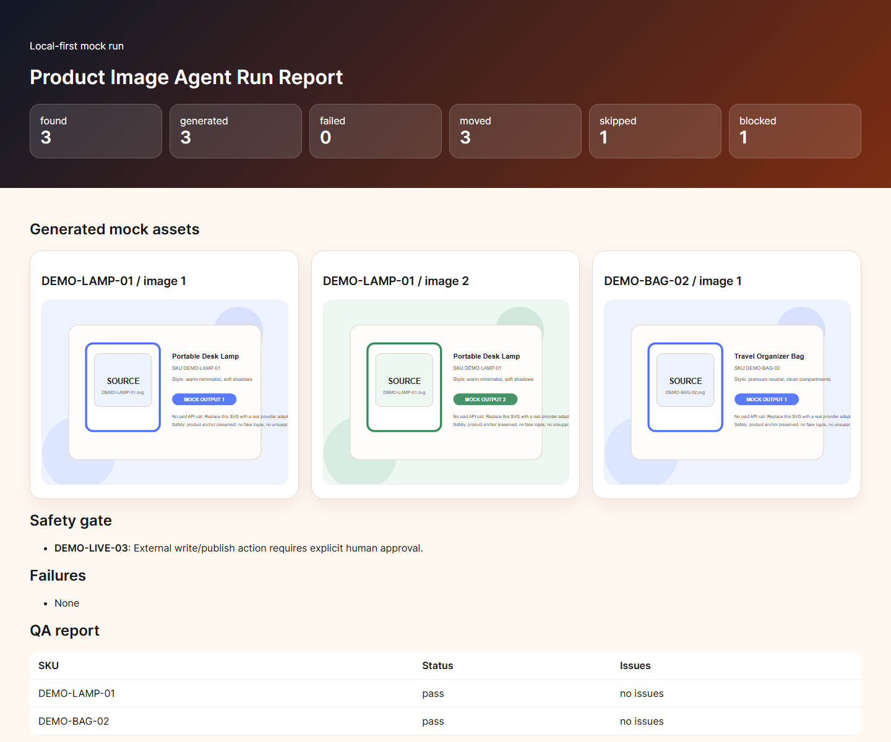
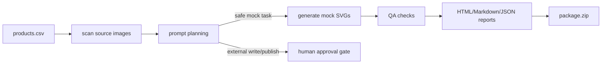

# Product Image Agent Kit

<p align="center">
  
</p>

<p align="center">
  <strong>Local-first AI product image workflow toolkit for e-commerce automation.</strong>
</p>

<p align="center">
  <a href="README.zh-CN.md">简体中文</a> ·
  <a href="#30-second-demo">30-second demo</a> ·
  <a href="#what-can-it-do">What it does</a> ·
  <a href="#safety-gate">Safety gate</a> ·
  <a href="#for-ai-agent-builders">For AI agents</a> ·
  <a href="CONTRIBUTING.md">Contributing</a>
</p>

<p align="center">
  
  
  
  
</p>

Most AI image demos stop at "generate an image". Real e-commerce image work needs the boring parts too: input checks, prompt plans, QA, logs, packages, and a hard stop before anything writes to a live store.

Product Image Agent Kit gives you that missing workflow layer.

If you are building AI image automation for e-commerce, **star this repo** to follow the mock-to-production roadmap.

## What can it do?

### 1. Turn product rows into prompt plans

Input a simple CSV or JSON file with SKU, product name, category, style, and output count. The planner creates structured prompt plans while keeping the product source image as the visual anchor.

### 2. Generate mock outputs without API keys

The default workflow generates deterministic SVG mock product images. You can test the full pipeline without OpenAI keys, paid image APIs, marketplace accounts, or private product data.

### 3. Write QA and handoff artifacts

Every run produces:

```text
report.html       # human-readable visual report
report.md         # lightweight handoff report
manifest.json     # structured run manifest
qa_report.json    # machine-readable QA result
events.jsonl      # audit log for each step
package.zip       # portable output package
```

### 4. Block unsafe live actions

Rows that request live upload, publish, overwrite, or delete are blocked by default and marked as requiring human approval.

## 30-second demo

```powershell
git clone https://github.com/Olalall/product-image-agent-kit.git product-image-agent-kit
cd product-image-agent-kit
python -m pip install -e .
python -m product_image_agent.cli demo --clean --out runs\demo
```

Open:

```text
runs/demo/report.html
```

Expected summary:

```text
found=3 generated=3 failed=0 moved=3 skipped=1 blocked=1
```

`blocked=1` is intentional: the sample includes one live publish request to demonstrate the approval gate.

## Quick CLI reference

Scan input readiness:

```powershell
python -m product_image_agent.cli scan --products examples\products.csv --images examples\input-images
```

Run a local workflow:

```powershell
python -m product_image_agent.cli run --products examples\products.csv --images examples\input-images --out runs\manual --clean
```

Use the explicit mock provider:

```powershell
python -m product_image_agent.cli run --provider mock --products examples\products.csv --images examples\input-images --out runs\manual --clean
```

Reserved real providers are blocked by default:

```powershell
python -m product_image_agent.cli run --provider openai --products examples\products.json --images examples\input-images --out runs\openai-blocked --clean
```

Even with `--confirm-cost`, the current release still blocks `openai` because the real adapter interface exists but no paid adapter is implemented yet.

Run the same workflow from JSON:

```powershell
python -m product_image_agent.cli run --products examples\products.json --images examples\input-images --out runs\json-demo --clean
```

Run tests:

```powershell
python -m unittest discover -s tests
```

Regenerate the README screenshot after running the demo:

```powershell
python -m product_image_agent.cli screenshot --report runs\demo\report.html --out docs\screenshots\report-demo.png
```

The screenshot command uses a local Chrome, Chromium, or Edge executable. If the browser is not auto-detected, pass:

```powershell
python -m product_image_agent.cli screenshot --browser "C:\Program Files\Google\Chrome\Application\chrome.exe"
```

Use without installing:

```powershell
$env:PYTHONPATH='src'
python -m product_image_agent.cli demo --clean --out runs\demo
```

If your Python scripts folder is on `PATH`, the console shortcut also works:

```powershell
product-image-agent demo --clean --out runs\demo
```

## Example input

See `examples/README.md` for the full example guide.

`examples/products.csv`:

```csv
sku,product_name,category,style,output_count,target,requested_action,source_image,notes
DEMO-LAMP-01,Portable Desk Lamp,home office,"warm minimalist, soft shadows",2,mock_only,generate_mock_images,DEMO-LAMP-01.svg,"show scale, no fake certification badges"
```

`examples/products.json`:

```json
{
  "products": [
    {
      "sku": "DEMO-LAMP-01",
      "product_name": "Portable Desk Lamp",
      "style": "warm minimalist, soft shadows",
      "output_count": 2
    }
  ]
}
```

Source images live in:

```text
examples/input-images/<SKU>.svg
```

A Shopify-oriented synthetic template is available at:

```text
examples/templates/shopify-products.csv
```

An Amazon-oriented synthetic image package template is available at:

```text
examples/templates/amazon-image-package.csv
```

It demonstrates main image, secondary feature image, and A+ banner planning slots without uploading to Amazon.

## Safety gate

The bundled sample includes one intentionally blocked row:

```csv
DEMO-LIVE-03,Glass Water Bottle,kitchen,"fresh lifestyle, bright background",1,shopify_live,publish_listing,...
```

Because this targets a live external channel, the planner returns:

```json
{
  "status": "blocked",
  "requires_human_approval": true,
  "reason": "External write/publish action requires explicit human approval."
}
```

## For AI agent builders

This repository is designed to be easy for coding agents to inspect and call:

- small Python modules;
- deterministic demo data;
- structured JSON artifacts;
- append-only `events.jsonl` logs;
- no-key mock mode;
- provider readiness checks;
- `--confirm-cost` safety gate for future paid providers;
- explicit safety boundaries in code and docs.

A coding agent can run the workflow, inspect `manifest.json`, read QA issues, and decide the next safe action without scraping prose.

## Why not just use Dify, ComfyUI, or LangChain?

Use those tools when you need a full AI app platform, image workflow graph, or general LLM framework.

Use Product Image Agent Kit when you need a small, inspectable starter for the operational layer around e-commerce product images:

| Need | This repo |
|---|---|
| CSV/SKU input checks | Yes |
| Source-image anchoring contract | Yes |
| Mock image outputs without API keys | Yes |
| QA and handoff package | Yes |
| Human approval gate for live actions | Yes |
| Provider interface with cost-confirmation gate | Yes |
| Full model/workflow platform | No |
| Marketplace uploader | No |

## Workflow



## Project structure

```text
src/product_image_agent/
  scanner.py      # CSV and source-image discovery
  planner.py      # prompt planning and safety decisions
  providers.py    # provider interface, mock provider, cost-confirmation gate
  generator.py    # deterministic mock SVG generation
  qa.py           # lightweight QA checks
  report.py       # JSON, Markdown, HTML, ZIP artifacts
  pipeline.py     # orchestration
  cli.py          # CLI entrypoint
```

## Who is this for?

- E-commerce operators prototyping product-image automation.
- AI automation builders who need a realistic non-chatbot portfolio project.
- Agent developers who want a small workflow with structured outputs and safety gates.
- Teams that want to test image-pipeline logic before connecting paid providers.

## What this is not

- Not a marketplace uploader.
- Not a paid image generation wrapper by default.
- Not a place to store real product secrets or customer data.
- Not an Amazon-only tool; the examples are generic and synthetic.

## Roadmap

- [x] Provider adapter interface with explicit cost confirmation.
- [ ] Real paid provider implementation behind the existing confirmation gate.
- [ ] Shopify and Amazon CSV templates.
- [x] Browser screenshot automation for `report.html`.
- [ ] More QA rules for copy claims, text density, aspect ratios, and source-image anchoring.
- [ ] Web UI for non-technical operators.

## For contributors

This project is intentionally small and mock-first. If you want to contribute, start here:

- Read `CONTRIBUTING.md`.
- Run `python -m unittest discover -s tests`.
- Pick one roadmap item or open a focused issue.
- Keep all sample data synthetic.
- CI template: `docs/github-actions-ci.yml` can be copied to `.github/workflows/ci.yml` after the maintainer pushes with a token that has GitHub Actions workflow permission.

Good first issues:

- Add a JSON input adapter.
- Extend the Shopify CSV template with more slots.
- Extend the Amazon image package template with more package roles.
- Add more QA checks for marketplace copy risks.
- Add a real-provider adapter interface with an explicit cost-confirmation gate.

## Share this project

If this repo helps your e-commerce image automation work:

1. Star it so you can follow the mock-to-production roadmap.
2. Share the screenshot above with the tagline: `Local-first AI product image workflow toolkit with mock generation, QA reports, and approval gates.`
3. Use `docs/launch-posts.md` for copy-paste launch drafts.

## License

MIT. This is a permissive open-source license; it does not mean this project is affiliated with, sponsored by, or endorsed by the Massachusetts Institute of Technology.
