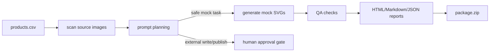

# Product Image Agent Kit

Local-first AI product image workflow toolkit with **CSV input**, **prompt planning**, **mock image generation**, **QA reports**, and **safe human approval gates**.

This repo is designed for e-commerce operators and automation builders who want a clean starting point for product-image pipelines without committing API keys, private product data, or marketplace credentials.

## Demo preview


## Why star this repo?

- **Runs without an API key**: the default demo is fully mock and deterministic.
- **Shows the whole workflow**: product rows → source-image scan → prompt plan → mock outputs → QA → package.
- **Built for safe automation**: external upload, overwrite, delete, and publish actions are blocked by a human approval gate.
- **Useful for AI agent builders**: every run writes structured artifacts (`manifest.json`, `qa_report.json`, `events.jsonl`).
- **Small enough to learn from**: Python standard library only for the default path.

## Quick start

```powershell
git clone <your-repo-url> product-image-agent-kit
cd product-image-agent-kit
python -m pip install -e .
python -m product_image_agent.cli demo --clean --out runs\demo
```

Open the report:

```text
runs/demo/report.html
```

The demo writes:

```text
runs/demo/
  report.html
  report.md
  manifest.json
  qa_report.json
  events.jsonl
  prompts/
  mock_outputs/
  package.zip
```

Expected demo summary:

```text
found=3 generated=3 failed=0 moved=3 skipped=1 blocked=1
```

`blocked=1` is intentional: the sample includes one live publish request to demonstrate the human approval gate.

## CLI commands

Scan input readiness:

```powershell
python -m product_image_agent.cli scan --products examples\products.csv --images examples\input-images
```

Run a custom local workflow:

```powershell
python -m product_image_agent.cli run --products examples\products.csv --images examples\input-images --out runs\manual --clean
```

Run tests:

```powershell
python -m unittest discover -s tests
```

Alternative without installing:

```powershell
$env:PYTHONPATH='src'
python -m product_image_agent.cli demo --clean --out runs\demo
```

If your Python scripts folder is on `PATH`, the console shortcut also works:

```powershell
product-image-agent demo --clean --out runs\demo
```

## For contributors

This project is intentionally small and mock-first. If you want to contribute, start here:

- Read `CONTRIBUTING.md`.
- Run `python -m unittest discover -s tests`.
- Pick one roadmap item or open a focused issue.
- Keep all sample data synthetic.

Useful starter issues:

- Add a JSON input adapter.
- Add a Shopify CSV template.
- Add more QA checks for marketplace copy risks.
- Add real-provider adapter interface with an explicit cost-confirmation gate.

## Example input

`examples/products.csv`:

```csv
sku,product_name,category,style,output_count,target,requested_action,source_image,notes
DEMO-LAMP-01,Portable Desk Lamp,home office,"warm minimalist, soft shadows",2,mock_only,generate_mock_images,DEMO-LAMP-01.svg,"show scale, no fake certification badges"
```

Source images live in:

```text
examples/input-images/<SKU>.svg
```

## Safety gate example

The bundled sample includes one intentionally blocked row:

```csv
DEMO-LIVE-03,Glass Water Bottle,kitchen,"fresh lifestyle, bright background",1,shopify_live,publish_listing,...
```

Because this targets a live external channel, the planner returns:

```json
{
  "status": "blocked",
  "requires_human_approval": true,
  "reason": "External write/publish action requires explicit human approval."
}
```

## Workflow



## Project structure

```text
src/product_image_agent/
  scanner.py      # CSV and source-image discovery
  planner.py      # prompt planning and safety decisions
  generator.py    # deterministic mock SVG generation
  qa.py           # lightweight QA checks
  report.py       # JSON, Markdown, HTML, ZIP artifacts
  pipeline.py     # orchestration
  cli.py          # CLI entrypoint
```

## What this is not

- Not a marketplace uploader.
- Not a paid image generation wrapper by default.
- Not a place to store real product secrets or customer data.
- Not an Amazon-only tool; the examples are generic and synthetic.

## Roadmap

- [ ] Real-provider adapter interface with explicit cost confirmation.
- [ ] Shopify and Amazon CSV templates.
- [ ] Browser screenshot automation for `report.html`.
- [ ] More QA rules for copy claims, text density, aspect ratios, and source-image anchoring.
- [ ] Web UI for non-technical operators.

## Launch notes

Before publishing to GitHub:

1. Replace `<your-repo-url>` in the quickstart after the repository exists.
2. Add topics: `ai-agents`, `ecommerce`, `image-generation`, `workflow-automation`, `product-images`.
3. Post the screenshot above with the short tagline: `Local-first AI product image workflow toolkit with mock generation, QA reports, and approval gates.`
4. Use `docs/launch-posts.md` for copy-paste launch drafts.

## License

MIT
