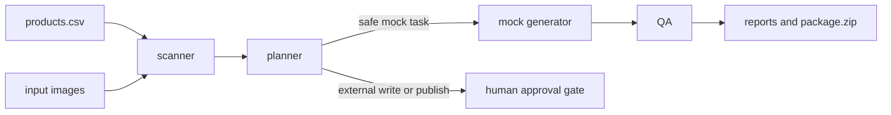

# Architecture

Product Image Agent Kit is intentionally small and local-first.

## Module boundaries

- `scanner.py`: CSV and source-image discovery. No generation logic.
- `planner.py`: prompt planning and safety-gate decisions. No filesystem writes.
- `providers.py`: provider interface, executable mock provider, and cost-confirmation readiness checks for reserved real providers.
- `generator.py`: deterministic mock SVG generation. No paid API calls.
- `qa.py`: lightweight output and copy-risk checks.
- `report.py`: JSON, Markdown, HTML, event log, and ZIP artifacts.
- `pipeline.py`: orchestration only.
- `cli.py`: command-line interface only.

## Public safety contract

The default project must remain runnable without credentials or paid APIs. Any future real-provider adapter should be additive and must require an explicit confirmation flag before spending money or writing to external systems.

Current provider status:

| Provider | Status | Behavior |
|---|---|---|
| `mock` | executable | Generates deterministic local SVG mock outputs. |
| `openai` | reserved | Requires `--confirm-cost`, then still blocks because the paid adapter is not implemented. |
